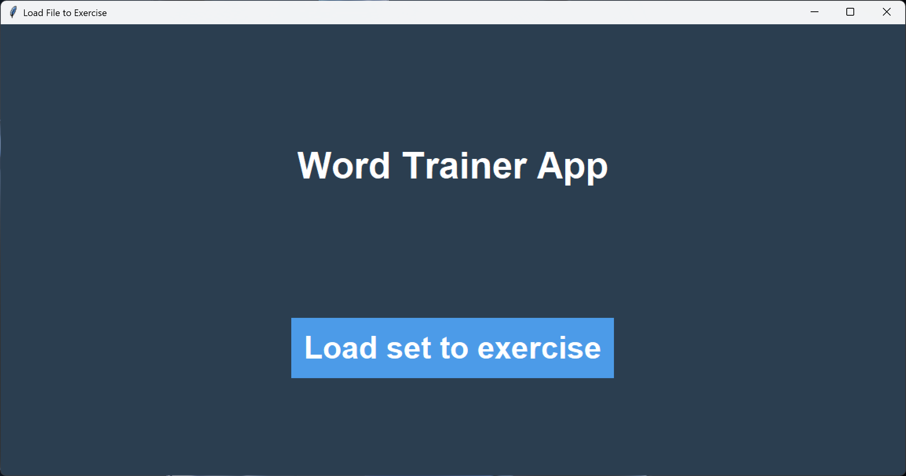
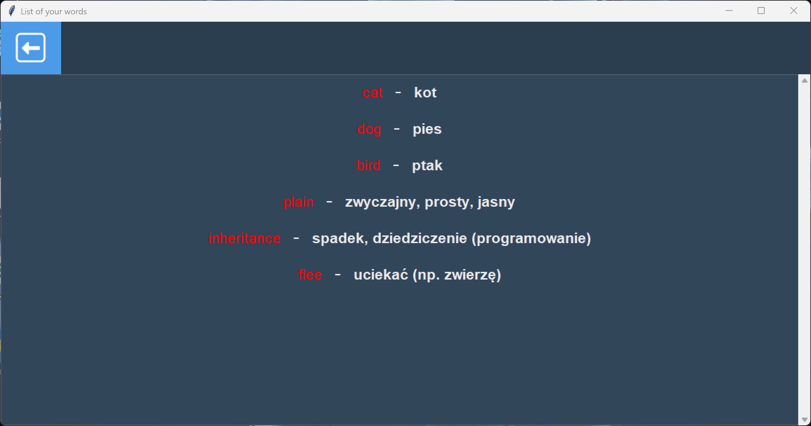
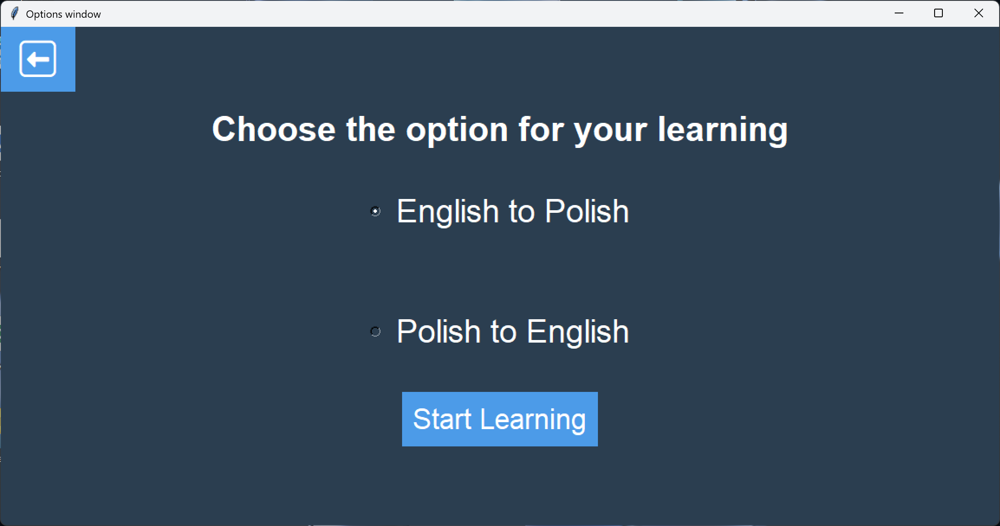
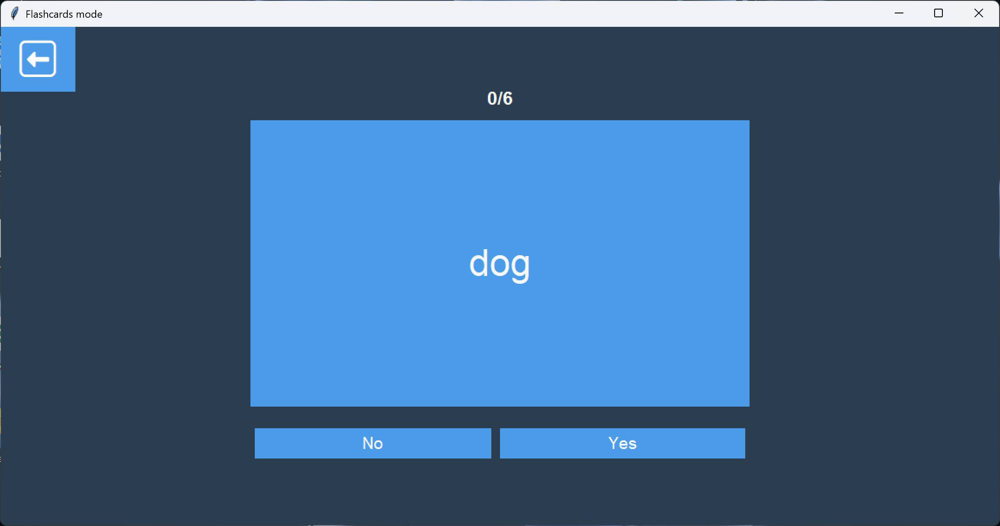
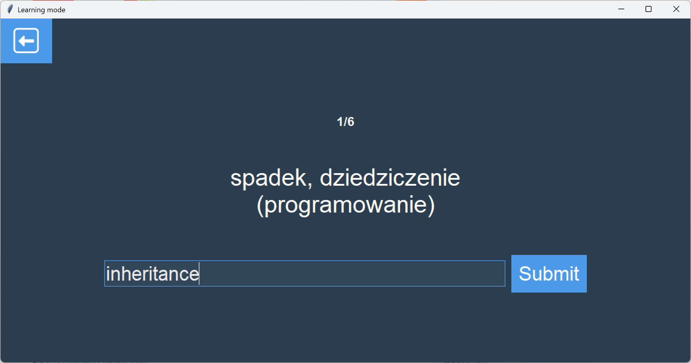
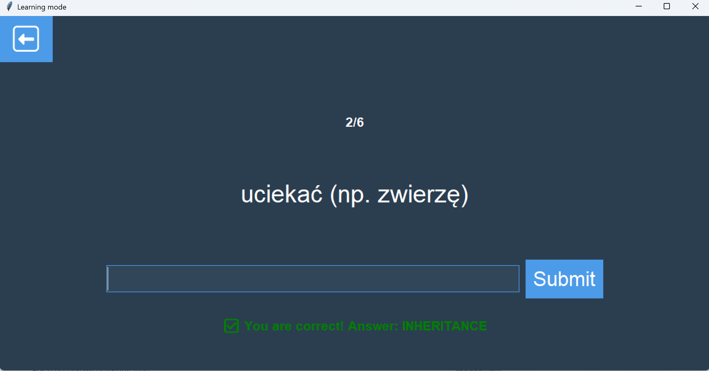
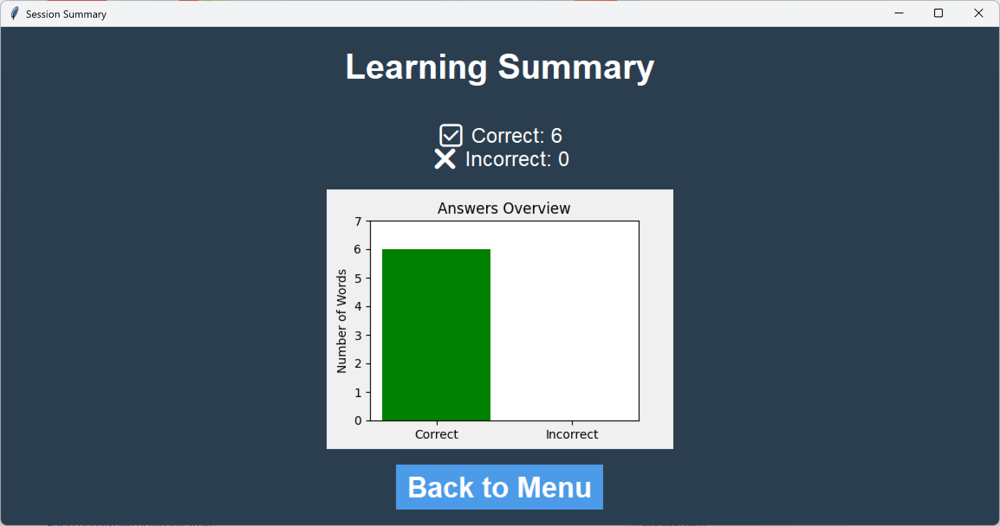

# Word-Trainer-App
A simple Python application to help you learn vocabulary through flashcards and quizzes. Built with Tkinter and a little bit ofMatplotlib.

## Features
- Loading your own learning set from file
- Flashcards mode with keyboard navigation
- Learning mode with answer checking
- List of words
- Summary screen with chart

## How to Run
```bash
python main.py
```

## How to preapre learning set correctly
- File with .txt extension
- Structure of file:
- word - meaning
- word - meaning

## Screenshots
















